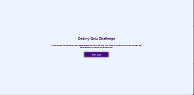

# codeQuiz
 
## Purpose
Create an Java script code quiz application that generates few java script quiz questions, This app will run in the browser and feature dynamically updated HTML and CSS powered by your JavaScript code. It will also feature a clean and polished user interface and be responsive, ensuring that it adapts to multiple screen sizes.

## Design:
The codeQuiz has just 4 pages namely index.html, game.html, end.html and highscores.html. It has couple of static style sheet files viz., style.css and game.css files. It has 3 javascript files game.js, end.js and highscores.js.

The html pages are designed using responsive flexbox components  so page is responsive to screen size changes and work well on all viewport sizes and devices. The pages are validated using java and js validation services and is free of errors and warnings.

The game.js, end.js and highscore.js adds the dynamic behavior to the respective pages. The game.js is the main crux of the app, it presents the user question and answer choices in sequences, processes the user answer choice and determines whether the answer is right or wrong. The scoring is also done by this js file.  The app starts with a 75 sec timer and counts down, everytime the user chooses a wrong answer, the user is penalized by deducting 10 sec from the timer. The remaining time on the clock is the user's score. Currently the quiz only chooses randomly 4 questions out of available 7 questions. It gives roughly 18 sec for each question to be answered. If the user takes too much time and clock runs out the user will get a final score of 0. If the user  answers all questions wrong but still some clock left, he will get a +ve score of remaining time. Finally the the user's score is stored in localStorage and later presented in end.html as his final score by retrieving it from localStorage. This is done using end.js.  The file end.js also prompts user's initials and tries to store it in localStorage if it happens to be in the top 5 highest scores. Otherwise it is not store. The highscores.js and highscores.html enable showing the 5 high scores, as well as provides a button the clear the high scores from localStorage. Also the highscores.html allows going back to main page to start the quiz afresh via a button.

It is  easy to extend the app from 7 available to several available questions, 4 presented questions to several more.  Accordingly we can change the count down timer from current 75 sec to a different higher value. It is also possible to extend the program to fetch the triva db from the web and present quiz off of the fetched questions. It should be possible to convert this javascript quiz to say c++ quiz or css quiz just to name a few by choosing different questions.

The highlight of the app is:
1. countdown timer(75 sec) with wrong answer penalty of 10 sec.
2. final score is remaining time on the countdown timer
3. Right answer is indicated in 3 ways.
   a) a green background change to chosen correct answer
   b) "Correct!" text underneath the answer choices
   c) a distinct sound for making right choice
4.  Wrong answer is indicated in 3 ways as well.
   a) a red background change to chosen incorrect answer
   b) "Incorrect! text underneath the answer choices
   c) a different distinct sound for making wrong choice.

### The code repository for this work can be found at:
[repository](https://github.com/s-suresh-kumar/codeQuiz)

### The hosted web page for this work can be found at:
[Deployed Application](https://s-suresh-kumar.github.io/codeQuiz/)

## Usage 
Click  on [Deployed Application](https://s-suresh-kumar.github.io/codequiz/) to launch Javascript code quiz game. Press "Start Quiz" to start the quiz. The user will be presented with a question followed by 4 answer choices. The clock starts now at 75 seconds and starts ticking down. By clicking on one of answer choices, the user can select his answer. The app validates user choice with correct answer and notifies the user whether it is right or wrong anser as detailed above.  The app also deducts 10 seconds as penalty to every wrong answer. Either when all questions ( it is 4 here) are run out or time runs out to zero, the user is presented with this final score using end.js/end.html.  Then user is asked enter his initials so that his final score can be stored if it is among the top 5 scores at that time. Once user submits his initials, the top 5 scores is presented using highscores.html and highscores.js.  Here the user is provided two buttons, one to clear all the highscores, another to return and play the game again to start (index.html) page.

